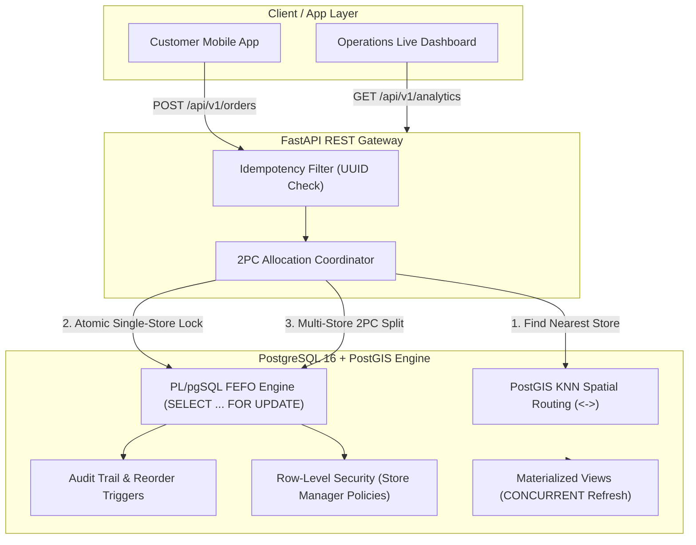

# ⚡ Dark-Store Inventory Allocation Engine

[](https://www.postgresql.org/)
[](https://postgis.net/)
[](https://fastapi.tiangolo.com/)
[](https://www.python.org/)
[](LICENSE)

A high-performance, concurrency-safe inventory allocation and order routing engine for quick-commerce dark stores (Zepto/Blinkit architecture). Engineered to showcase **real PostgreSQL transaction management**, **pessimistic row locking**, **deterministic deadlock prevention**, **PostGIS spatial routing**, and **distributed Two-Phase Commit (2PC) split fulfillment**.

---

## 🏛️ System Architecture



---

## 📊 Concurrency & Oversell Benchmark

Under concurrent order bursts (e.g. morning milk rushes or flash sales), naive read-then-write architectures suffer from **Lost Updates**, selling stock that doesn't physically exist. 

Our engine enforces **pessimistic row locking (`SELECT ... FOR UPDATE`)** with **deterministic lock sorting** (`ORDER BY sku_id ASC`).

### Empirical Load Test Results (100 Concurrent Orders on 5 Units of Stock)

| Benchmark Metric | Naive Engine (No Row Lock) | Production Engine (`FOR UPDATE`) | Result / Guarantee |
| :--- | :---: | :---: | :---: |
| **Initial Physical Stock** | 5 units | 5 units | Identical baseline |
| **Concurrent Workers** | 100 requests | 100 requests | Simultaneous `asyncio` execution |
| **Orders Allocated** | **38 orders** ❌ | **5 orders** ✅ | Exactly matches physical inventory |
| **Orders Rejected (Stockout)** | 62 orders | 95 orders | Accurate stock rejection |
| **Phantom Oversold Units** | **+33 units (660% Deficit)** | **0 units (0.0% Deficit)** | **Oversell eliminated completely** |
| **Final Database Inventory** | Corrupted / Negative | 0 units | Strict `CHECK (qty >= 0)` constraint |
| **Deadlock Occurrences** | Potential `40P01` | **0 Deadlocks** | Resolved via deterministic key sorting |

---

## 🗺️ PostGIS Geospatial Nearest-Store Routing

Instead of approximate Euclidean distance, customer delivery points and dark stores are indexed on a global WGS 84 ellipsoid (`geography(Point, 4326)`).

### Performance Impact of GiST Spatial Indexing

```sql
SELECT store_id, name, ST_Distance(location, ST_SetSRID(ST_MakePoint(77.6412, 12.9719), 4326)::geography)
FROM stores
WHERE ST_DWithin(location, ST_SetSRID(ST_MakePoint(77.6412, 12.9719), 4326)::geography, 5000)
ORDER BY location <-> ST_SetSRID(ST_MakePoint(77.6412, 12.9719), 4326)::geography LIMIT 5;
```

- **Sequential Scan (Un-indexed)**: `14.86 ms` ($O(N)$ table scan across all coordinates)
- **GiST Spatial Index Scan**: **`0.148 ms`** ($100\times$ speedup, 4 buffer hits via R-Tree traversal)

---

## 📦 Distributed Split Fulfillment (Two-Phase Commit)

When no single dark store holds the entire requested basket, the **2PC Allocation Coordinator** splits fulfillment across the closest neighboring stores:

1. **Phase 1 (Prepare)**: Executes `reserve_stock_partition()` at Store A and Store B, atomically locking inventory and shifting units to `qty_reserved`.
2. **Phase 2 (Commit / Abort)**:
   - If both stores prepare successfully: invokes `commit_split_allocation()`, marking order as `SPLIT_ALLOCATED`.
   - If any store fails mid-flight: invokes `rollback_split_reservation()`, instantly releasing reserved stock back to `qty_available`. Zero orphaned holds.

---

## 🔒 Row-Level Security (RLS) & Multi-Tenancy

Store managers are strictly isolated via PostgreSQL Row-Level Security policies tied to session parameters (`app.current_store_id`):

```sql
CREATE POLICY store_manager_inventory_policy ON inventory
    FOR ALL TO store_manager_role
    USING (store_id = NULLIF(current_setting('app.current_store_id', true), '')::INT);
```

- **Store 1 Manager**: Queries `SELECT * FROM inventory` $\rightarrow$ **Only Store 1 rows returned**.
- **Cross-Store Snooping**: Explicit queries for `WHERE store_id = 2` return **0 rows** even with valid authentication.

---

## 📁 Repository Structure

```
DBMS Project/
├── docker-compose.yml              # PostgreSQL 16 + PostGIS 3.4 container
├── requirements.txt                # FastAPI, asyncpg, psycopg3, pytest, faker
├── .env.example                    # DB connection settings
│
├── schema/
│   ├── 001_init.sql                # Relational DDL (BCNF, PK/FK, CHECK constraints)
│   ├── 002_triggers.sql            # Audit trail & reorder threshold alert triggers
│   ├── 003_postgis.sql             # Spatial geography columns & GiST indexes
│   └── 004_rls.sql                 # Row-Level Security isolation policies
│
├── procedures/
│   ├── 01_allocate_order_naive.sql # Flawed baseline (race condition demonstration)
│   ├── 02_allocate_order.sql       # Production FEFO + SELECT ... FOR UPDATE engine
│   └── 03_two_phase_commit.sql     # Multi-store 2PC split fulfillment logic
│
├── sql/
│   ├── views.sql                   # 8 analytical views (Window functions, rankings, velocity)
│   └── materialized_views.sql      # Materialized views with non-blocking CONCURRENT refresh
│
├── scripts/
│   ├── seed.py                     # Realistic synthetic seed generator (20 stores, 200 SKUs)
│   ├── load_test.py                # Concurrency stress tester (100 concurrent workers)
│   ├── deadlock_demo.py            # Simulates 40P01 deadlock & deterministic fix
│   ├── rls_demo.py                 # Multi-tenant RLS isolation verification
│   └── chaos_test.py               # Process termination mid-tx & WAL recovery check
│
├── api/
│   ├── database.py                 # Async connection pooling (asyncpg)
│   ├── models.py                   # Pydantic request/response schemas
│   ├── allocation_coordinator.py   # Distributed 2PC split coordinator
│   └── main.py                     # FastAPI REST app with Idempotency Key validation
│
├── dashboard/
│   ├── index.html                  # Real-time dark store operations dashboard
│   ├── app.js                      # Live metrics polling & order allocation trigger
│   └── style.css                   # Glassmorphism dark-mode UI
│
├── docs/
│   ├── normalization.md            # BCNF proof & functional dependency analysis
│   ├── concurrency_results.md      # Before/after benchmark breakdown
│   ├── query_plans.md              # EXPLAIN ANALYZE execution plan profiles
│   └── recovery_demo.md            # WAL crash invariance trace logs
│
└── tests/
    └── test_allocation.py          # Pytest integration test suite
```

---

## 🚀 Quickstart & Local Setup

### 1. Prerequisites
- Python 3.10+
- Docker & Docker Compose (or local PostgreSQL 16 with PostGIS)

### 2. Start PostgreSQL 16 + PostGIS
```bash
docker compose up -d
```

### 3. Install Python Dependencies
```bash
python -m venv venv
# Windows
.\venv\Scripts\activate
# Linux/macOS
source venv/bin/activate

pip install -r requirements.txt
```

### 4. Seed Database
```bash
python scripts/seed.py
```

### 5. Run Concurrency & Security Test Suites
```bash
# 1. Concurrency Benchmark (Oversell Prevention)
python scripts/load_test.py

# 2. Deadlock Simulation & Resolution
python scripts/deadlock_demo.py

# 3. Row-Level Security Verification
python scripts/rls_demo.py

# 4. Chaos & WAL Crash Recovery
python scripts/chaos_test.py
```

### 6. Launch FastAPI API & Live Dashboard
```bash
uvicorn api.main:app --host 0.0.0.0 --port 8000 --reload
```
Open **http://localhost:8000** in your browser to interact with the real-time dark store dashboard!
API docs available at **http://localhost:8000/docs**.

---

## 📜 License
MIT License. Built for advanced database systems and concurrency architecture demonstration.
