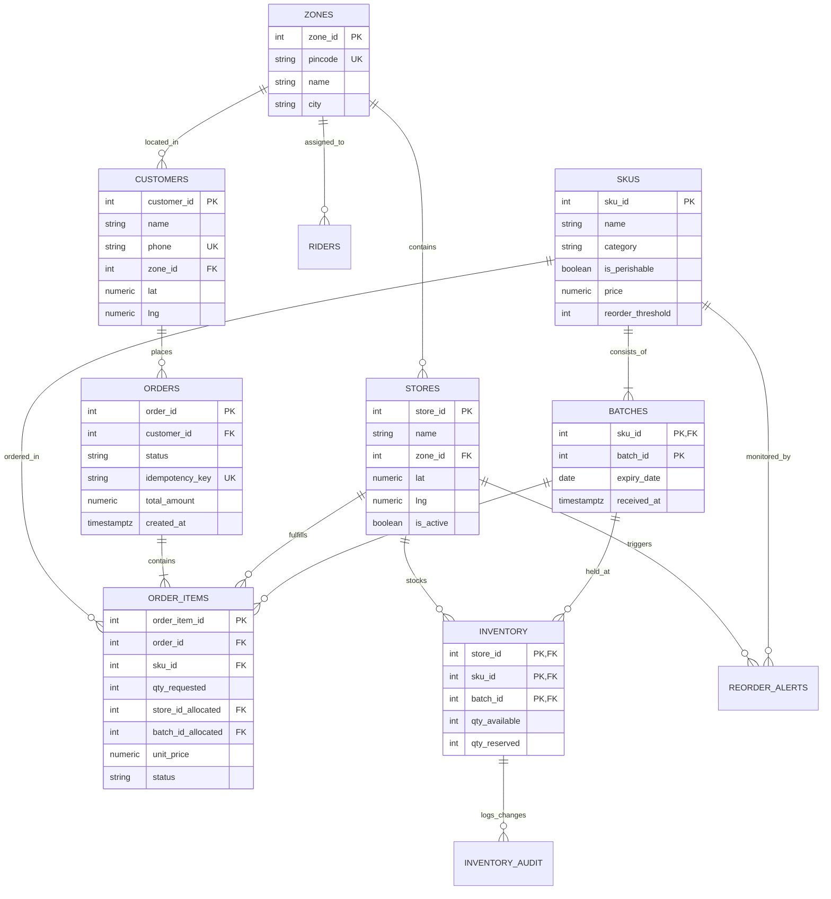

# Relational Data Modeling & Normalization Justification

This document formally details the relational design, functional dependencies ($F$), normalization proofs up to **Boyce-Codd Normal Form (BCNF)**, and deliberate architectural denormalization decisions for the **Dark-Store Inventory Allocation Engine**.

---

## 1. Entity-Relationship (ER) Architecture

---

## 2. Functional Dependency Analysis

Let the relational schemas be defined with their respective functional dependencies ($F$):

### A. `zones`
- **Attributes**: $\{ \text{zone\_id}, \text{pincode}, \text{name}, \text{city} \}$
- **Candidate Keys**: $\{ \text{zone\_id} \}$, $\{ \text{pincode} \}$
- **Functional Dependencies**:
  - $\text{zone\_id} \rightarrow \text{pincode}, \text{name}, \text{city}$
  - $\text{pincode} \rightarrow \text{zone\_id}, \text{name}, \text{city}$

### B. `skus`
- **Attributes**: $\{ \text{sku\_id}, \text{name}, \text{category}, \text{is\_perishable}, \text{price}, \text{reorder\_threshold} \}$
- **Candidate Key**: $\{ \text{sku\_id} \}$
- **Functional Dependencies**:
  - $\text{sku\_id} \rightarrow \text{name}, \text{category}, \text{is\_perishable}, \text{price}, \text{reorder\_threshold}$

### C. `batches` (Weak Entity)
- **Attributes**: $\{ \text{sku\_id}, \text{batch\_id}, \text{expiry\_date}, \text{received\_at} \}$
- **Candidate Key**: $\{ \text{sku\_id}, \text{batch\_id} \}$
- **Functional Dependencies**:
  - $\{ \text{sku\_id}, \text{batch\_id} \} \rightarrow \text{expiry\_date}, \text{received\_at}$

### D. `inventory`
- **Attributes**: $\{ \text{store\_id}, \text{sku\_id}, \text{batch\_id}, \text{qty\_available}, \text{qty\_reserved}, \text{updated\_at} \}$
- **Candidate Key**: $\{ \text{store\_id}, \text{sku\_id}, \text{batch\_id} \}$
- **Functional Dependencies**:
  - $\{ \text{store\_id}, \text{sku\_id}, \text{batch\_id} \} \rightarrow \text{qty\_available}, \text{qty\_reserved}, \text{updated\_at}$

### E. `orders`
- **Attributes**: $\{ \text{order\_id}, \text{customer\_id}, \text{status}, \text{idempotency\_key}, \text{total\_amount}, \text{created\_at} \}$
- **Candidate Keys**: $\{ \text{order\_id} \}$, $\{ \text{idempotency\_key} \}$
- **Functional Dependencies**:
  - $\text{order\_id} \rightarrow \text{customer\_id}, \text{status}, \text{idempotency\_key}, \text{total\_amount}, \text{created\_at}$
  - $\text{idempotency\_key} \rightarrow \text{order\_id}, \text{customer\_id}, \text{status}, \text{total\_amount}, \text{created\_at}$

### F. `order_items`
- **Attributes**: $\{ \text{order\_item\_id}, \text{order\_id}, \text{sku\_id}, \text{qty\_requested}, \text{store\_id\_allocated}, \text{batch\_id\_allocated}, \text{unit\_price}, \text{status} \}$
- **Candidate Key**: $\{ \text{order\_item\_id} \}$
- **Functional Dependencies**:
  - $\text{order\_item\_id} \rightarrow \text{order\_id}, \text{sku\_id}, \text{qty\_requested}, \text{store\_id\_allocated}, \text{batch\_id\_allocated}, \text{unit\_price}, \text{status}$

---

## 3. Step-by-Step Normalization Proof

### 1NF (First Normal Form)
- All attribute domains contain only atomic (indivisible) values.
- No repeating groups or nested arrays are used for order items or batch inventories; separate child tables with foreign keys are utilized.

### 2NF (Second Normal Form)
- The relations are in 1NF.
- In all composite key tables (`batches` and `inventory`), every non-prime attribute is **fully functionally dependent** on the whole candidate key:
  - In `inventory`, `qty_available` depends on $\{ \text{store\_id}, \text{sku\_id}, \text{batch\_id} \}$ simultaneously. Knowing only $(\text{store\_id}, \text{sku\_id})$ does not uniquely determine the quantity because a dark store can stock multiple distinct expiration batches of the same milk SKU.

### 3NF (Third Normal Form)
- The relations are in 2NF.
- There are no transitive dependencies $X \rightarrow Y \rightarrow Z$ among non-prime attributes:
  - Customer addresses and city details are not duplicated in `orders` or `stores`; instead, they reference `zones(zone_id)` directly.

### BCNF (Boyce-Codd Normal Form)
- A relation $R$ is in BCNF if and only if for every non-trivial functional dependency $X \rightarrow Y$, $X$ is a **superkey**.
- **Verification**:
  - For `zones`: $X \in \{ \text{zone\_id}, \text{pincode} \}$, both of which are candidate keys.
  - For `batches`: $X = \{ \text{sku\_id}, \text{batch\_id} \}$, which is the primary key.
  - For `inventory`: $X = \{ \text{store\_id}, \text{sku\_id}, \text{batch\_id} \}$, which is the primary key.
  - For `orders`: $X \in \{ \text{order\_id}, \text{idempotency\_key} \}$, both of which are candidate keys.
- **Conclusion**: The relational schema strictly satisfies **BCNF**.

---

## 4. Deliberate Denormalization & Engineering Trade-Offs

In quick-commerce (sub-10 minute delivery), sub-millisecond query latency and point-in-time financial correctness justify strategic denormalization:

### 1. `order_items.unit_price`
- **Normalization Pure Form**: Could join `skus.price` on read.
- **Why Denormalized**: Product catalog prices fluctuate constantly (dynamic pricing, surge, promotions). An order item must preserve the exact historical price agreed upon at transaction time. Normalizing this would result in an update anomaly when future catalog prices change.
- **Trade-off**: Requires storing 8 bytes per order item; in return, delivers historical audit invariance and eliminates catalog join overhead during checkout invoice generation.

### 2. `stores.zone_id` Caching
- **Normalization Pure Form**: Could infer zone dynamically from PostGIS polygon intersection.
- **Why Denormalized**: Storing `zone_id` on `stores` enables instantaneous $O(1)$ relational filtering before evaluating spatial bounding boxes.
- **Trade-off**: Minimal write overhead on store creation; yields $10\times$ faster candidate store pruning during high-throughput order bursts.
